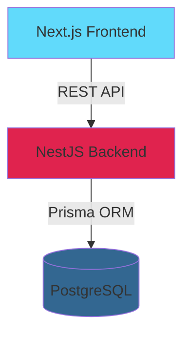

# Documento de Arquitetura - NetworkHubs

## 1. Diagrama da Arquitetura



### Componentes Principais

- **Frontend (Next.js)**: Interface do usuário com App Router
- **Backend (NestJS)**: API REST com módulos organizados
- **Banco de Dados (PostgreSQL)**: Banco relacional para integridade dos dados

---

## 2. Modelo de Dados

### Escolha do Banco de Dados: PostgreSQL

**Justificativa:**

- Relacionamentos entre entidades (membros, indicações, convites)
- Transações ACID para operações críticas
- Suporte a índices para performance
- Maturidade e confiabilidade

### Schema do Banco de Dados (Foco no Essencial)

```sql
-- Intenções de Participação (Módulo Obrigatório)
CREATE TABLE participation_intentions (
    id UUID PRIMARY KEY DEFAULT gen_random_uuid(),
    name VARCHAR(255) NOT NULL,
    email VARCHAR(255) NOT NULL,
    phone VARCHAR(50),
    company VARCHAR(255),
    message TEXT,
    status VARCHAR(50) NOT NULL DEFAULT 'pending', -- 'pending', 'approved', 'rejected'
    reviewed_at TIMESTAMP,
    created_at TIMESTAMP DEFAULT NOW()
);

-- Convites para Cadastro
CREATE TABLE registration_invites (
    id UUID PRIMARY KEY DEFAULT gen_random_uuid(),
    intention_id UUID REFERENCES participation_intentions(id) ON DELETE CASCADE,
    token VARCHAR(255) UNIQUE NOT NULL,
    email VARCHAR(255) NOT NULL,
    expires_at TIMESTAMP NOT NULL,
    used_at TIMESTAMP,
    created_at TIMESTAMP DEFAULT NOW()
);

-- Usuários
CREATE TABLE users (
    id UUID PRIMARY KEY DEFAULT gen_random_uuid(),
    email VARCHAR(255) UNIQUE NOT NULL,
    password_hash VARCHAR(255) NOT NULL,
    role VARCHAR(50) NOT NULL DEFAULT 'member', -- 'admin', 'member'
    created_at TIMESTAMP DEFAULT NOW()
);

-- Membros
CREATE TABLE members (
    id UUID PRIMARY KEY DEFAULT gen_random_uuid(),
    user_id UUID REFERENCES users(id) ON DELETE CASCADE,
    name VARCHAR(255) NOT NULL,
    company VARCHAR(255),
    phone VARCHAR(50),
    bio TEXT,
    status VARCHAR(50) NOT NULL DEFAULT 'active',
    created_at TIMESTAMP DEFAULT NOW()
);

-- Indicações de Negócios
CREATE TABLE business_referrals (
    id UUID PRIMARY KEY DEFAULT gen_random_uuid(),
    referrer_id UUID REFERENCES members(id) NOT NULL,
    referred_id UUID REFERENCES members(id) NOT NULL,
    title VARCHAR(255) NOT NULL,
    description TEXT NOT NULL,
    value DECIMAL(10, 2),
    status VARCHAR(50) NOT NULL DEFAULT 'pending', -- 'pending', 'in_progress', 'closed', 'lost'
    created_at TIMESTAMP DEFAULT NOW(),
    updated_at TIMESTAMP DEFAULT NOW()
);

-- Obrigados
CREATE TABLE acknowledgments (
    id UUID PRIMARY KEY DEFAULT gen_random_uuid(),
    referral_id UUID REFERENCES business_referrals(id) ON DELETE CASCADE,
    from_member_id UUID REFERENCES members(id) NOT NULL,
    to_member_id UUID REFERENCES members(id) NOT NULL,
    message TEXT NOT NULL,
    is_public BOOLEAN DEFAULT true,
    created_at TIMESTAMP DEFAULT NOW()
);

-- Índices para Performance
CREATE INDEX idx_intentions_status ON participation_intentions(status);
CREATE INDEX idx_invites_token ON registration_invites(token);
CREATE INDEX idx_invites_email ON registration_invites(email);
CREATE INDEX idx_referrals_referrer ON business_referrals(referrer_id);
CREATE INDEX idx_referrals_referred ON business_referrals(referred_id);
```

### Relacionamentos Principais

- **Participation Intentions ↔ Registration Invites**: 1:1 (cada intenção aprovada gera um convite)
- **Users ↔ Members**: 1:1 (cada membro tem um usuário)
- **Members ↔ Business Referrals**: 1:N (membro pode fazer várias indicações)

---

## 3. Estrutura de Componentes (Frontend)

### Organização de Pastas Simplificada

```
apps/frontend/
├── src/
│   ├── app/
│   │   ├── participation-form/        # Página pública de intenção
│   │   ├── admin/                      # Área do admin (protegida por env)
│   │   │   └── intentions/            # Lista e aprovação de intenções
│   │   ├── register/                   # Cadastro completo com token
│   │   │   └── [token]/               # Página dinâmica com token
│   │   └── referrals/                 # Sistema de indicações (opcional)
│   │       ├── new/                   # Criar indicação
│   │       └── list/                   # Listar indicações
│   ├── components/
│   │   ├── ui/                        # Componentes base reutilizáveis
│   │   │   ├── Button.tsx
│   │   │   ├── Card.tsx
│   │   │   ├── Input.tsx
│   │   │   └── Modal.tsx
│   │   ├── ParticipationForm.tsx      # Formulário de intenção
│   │   ├── RegistrationForm.tsx        # Formulário de cadastro
│   │   ├── IntentionsList.tsx         # Lista de intenções (admin)
│   │   └── ReferralForm.tsx           # Formulário de indicação
│   ├── lib/
│   │   └── api.ts                     # Cliente API centralizado
│   └── types/
│       ├── intention.ts
│       ├── member.ts
│       └── referral.ts
```

### Decisões de Arquitetura Frontend

1. **App Router do Next.js**: Roteamento moderno e Server Components
2. **Componentes Reutilizáveis**: Biblioteca `@repo/ui` para componentes base
3. **Cliente API Simples**: Funções centralizadas para chamadas à API
4. **Proteção Admin**: Variável de ambiente `ADMIN_SECRET` para acesso à área admin

---

## 4. Definição da API

### Base URL

```
http://localhost:3001/api
```

### Autenticação

Área admin protegida por header:

```
X-Admin-Secret: <ADMIN_SECRET>
```

### Endpoints Principais

#### 1. Gestão de Membros (Módulo Obrigatório)

##### POST `/participation-intentions`

Criar intenção de participação (público)

**Request:**

```json
{
  "name": "João Silva",
  "email": "joao@example.com",
  "phone": "+5511999999999",
  "company": "Empresa XYZ",
  "message": "Gostaria de participar do NetworkHubs"
}
```

**Response (201):**

```json
{
  "id": "uuid",
  "name": "João Silva",
  "email": "joao@example.com",
  "status": "pending",
  "createdAt": "2024-01-15T10:00:00Z"
}
```

##### GET `/admin/participation-intentions`

Listar intenções (admin)

**Headers:**

```
X-Admin-Secret: <ADMIN_SECRET>
```

**Query Params:**

- `status`: `pending` | `approved` | `rejected`

**Response (200):**

```json
{
  "data": [
    {
      "id": "uuid",
      "name": "João Silva",
      "email": "joao@example.com",
      "phone": "+5511999999999",
      "company": "Empresa XYZ",
      "message": "Gostaria de participar",
      "status": "pending",
      "createdAt": "2024-01-15T10:00:00Z"
    }
  ]
}
```

##### PATCH `/admin/participation-intentions/:id/approve`

Aprovar intenção e gerar convite (admin)

**Headers:**

```
X-Admin-Secret: <ADMIN_SECRET>
```

**Response (200):**

```json
{
  "intention": {
    "id": "uuid",
    "status": "approved",
    "reviewedAt": "2024-01-15T11:00:00Z"
  },
  "invite": {
    "token": "abc123xyz",
    "email": "joao@example.com",
    "expiresAt": "2024-01-22T11:00:00Z",
    "registrationUrl": "http://localhost:3000/register/abc123xyz"
  }
}
```

##### PATCH `/admin/participation-intentions/:id/reject`

Recusar intenção (admin)

**Headers:**

```
X-Admin-Secret: <ADMIN_SECRET>
```

**Response (200):**

```json
{
  "id": "uuid",
  "status": "rejected",
  "reviewedAt": "2024-01-15T11:00:00Z"
}
```

##### GET `/register/validate/:token`

Validar token de convite (público)

**Response (200):**

```json
{
  "valid": true,
  "email": "joao@example.com",
  "expiresAt": "2024-01-22T11:00:00Z"
}
```

**Response (400):**

```json
{
  "valid": false,
  "message": "Token inválido ou expirado"
}
```

##### POST `/register/:token`

Cadastro completo de membro (público com token válido)

**Request:**

```json
{
  "name": "João Silva",
  "email": "joao@example.com",
  "password": "senhaSegura123",
  "company": "Empresa XYZ",
  "phone": "+5511999999999",
  "bio": "Descrição profissional"
}
```

**Response (201):**

```json
{
  "id": "uuid",
  "name": "João Silva",
  "email": "joao@example.com",
  "status": "active",
  "createdAt": "2024-01-15T12:00:00Z"
}
```

#### 2. Sistema de Indicações (Módulo Opcional A)

##### POST `/referrals`

Criar indicação de negócio (membro autenticado)

**Headers:**

```
Authorization: Bearer <JWT_TOKEN>
```

**Request:**

```json
{
  "referredId": "uuid",
  "title": "Oportunidade de Venda",
  "description": "Cliente precisa de serviço X",
  "value": 50000.0
}
```

**Response (201):**

```json
{
  "id": "uuid",
  "referrer": {
    "id": "uuid",
    "name": "João Silva"
  },
  "referred": {
    "id": "uuid",
    "name": "Maria Santos"
  },
  "title": "Oportunidade de Venda",
  "description": "Cliente precisa de serviço X",
  "value": 50000.0,
  "status": "pending",
  "createdAt": "2024-01-15T10:00:00Z"
}
```

##### GET `/referrals`

Listar indicações (membro autenticado)

**Headers:**

```
Authorization: Bearer <JWT_TOKEN>
```

**Query Params:**

- `status`: `pending` | `in_progress` | `closed` | `lost`
- `type`: `sent` | `received`

**Response (200):**

```json
{
  "data": [
    {
      "id": "uuid",
      "title": "Oportunidade de Venda",
      "status": "pending",
      "value": 50000.0,
      "referrer": { "id": "uuid", "name": "João Silva" },
      "referred": { "id": "uuid", "name": "Maria Santos" },
      "createdAt": "2024-01-15T10:00:00Z"
    }
  ]
}
```

##### PATCH `/referrals/:id/status`

Atualizar status da indicação (membro autenticado)

**Headers:**

```
Authorization: Bearer <JWT_TOKEN>
```

**Request:**

```json
{
  "status": "closed"
}
```

**Response (200):**

```json
{
  "id": "uuid",
  "status": "closed",
  "updatedAt": "2024-01-20T10:00:00Z"
}
```

##### POST `/referrals/:id/acknowledgments`

Criar obrigado (agradecimento) (membro autenticado)

**Headers:**

```
Authorization: Bearer <JWT_TOKEN>
```

**Request:**

```json
{
  "message": "Muito obrigado pela indicação! O negócio foi fechado.",
  "isPublic": true
}
```

**Response (201):**

```json
{
  "id": "uuid",
  "referralId": "uuid",
  "from": { "id": "uuid", "name": "Maria Santos" },
  "to": { "id": "uuid", "name": "João Silva" },
  "message": "Muito obrigado pela indicação!",
  "isPublic": true,
  "createdAt": "2024-01-20T10:00:00Z"
}
```

### Códigos de Status HTTP

- `200 OK`: Sucesso
- `201 Created`: Recurso criado
- `400 Bad Request`: Dados inválidos
- `401 Unauthorized`: Não autenticado
- `403 Forbidden`: Sem permissão
- `404 Not Found`: Recurso não encontrado
- `500 Internal Server Error`: Erro do servidor

---

## Considerações de Implementação

1. **Proteção Admin**: Usar variável de ambiente `ADMIN_SECRET` no backend
2. **Validação de Dados**: DTOs com class-validator no NestJS
3. **Tokens de Convite**: Gerar tokens únicos e seguros (UUID ou crypto.randomBytes)
4. **Expiração de Tokens**: Convites válidos por 7 dias
5. **Simulação de Email**: Log no console ao invés de envio real de email
